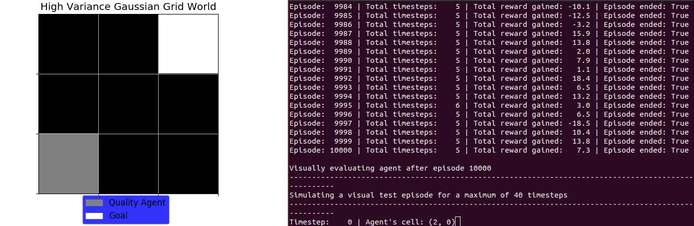
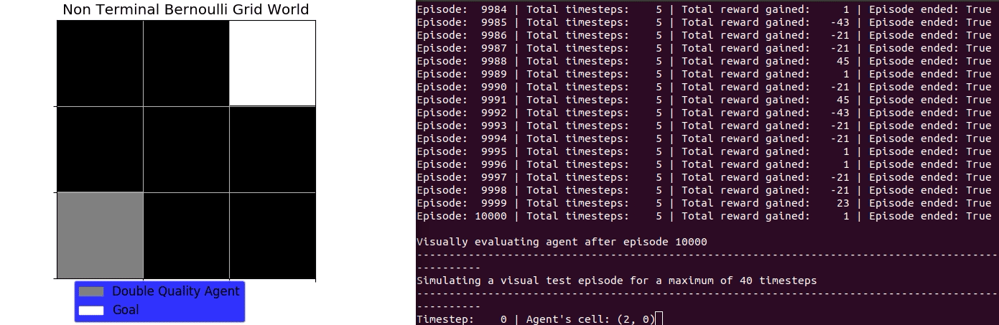
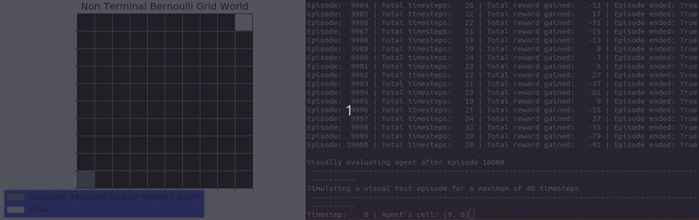

# Overestimation Bias Reinforcement Learning Simulation Code

This repository contains code that can be used to run simulations with reinforcement learning agents that interact with grid world environments. It was created for the final research project of my master's degree. Variation-resistant Q-learning is a reinforcement learning algorithm that was developed during the project. The final research project report (i.e. master’s thesis) url is provided below.

Master's thesis url: http://fse.studenttheses.ub.rug.nl/22173/


## Installation

It is recommended to install conda and then create an environment for the simulation software using the ```environment.yaml``` file. A suggestion on how to install the simulation software and activate the environment is provided below.

```bash
git clone https://github.com/anpenta/overestimation-bias-reinforcement-learning-simulation-code.git
cd overestimation-bias-reinforcement-learning-simulation-code
conda env create -f environment.yaml
conda activate overestimation-bias-reinforcement-learning
```

## Running the simulations

To run the simulations you can provide commands through the terminal using the ```simulate``` module. An example is given below.

```bash
python3 simulate.py training_episodes variation-resistant-quality-agent grid-world bernoulli 3 1000 500 1 100
```
This will run the ```simulate_training_episodes``` function with an agent that uses Variation-resistant Q-learning, a 3x3 grid world environment, and the Bernoulli reward function. The agent will interact with the environment for 1000 episodes for a maximum of 500 time steps each, the random seed will be set to 1, and a visual test episode will run every 100 training episodes. An example of how to see the arguments for each simulation function is provided below.

```bash
python3 simulate.py training_episodes --help
```

## Results

As an example, below are some animations of the agents interacting with the environments.










## Sources
* Hasselt, Hado V. "Double Q-learning." Advances in neural information processing systems. 2010.
* Watkins, Christopher John Cornish Hellaby. "Learning from delayed rewards." (1989).
